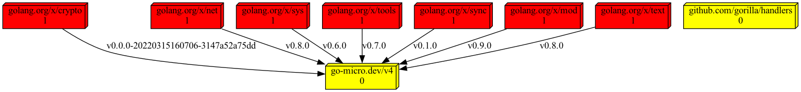

# monalizer
the go mod visualizer + heat map

.dot output (plantUML / graphviz)

## Usage
- create config file(copy cfg/example.yaml) and place it anywhere you want
- start visualizer `go run main.go -conf cfg/example.yaml` (default to ignored cfg/conf.yaml). It will generate output file (like out/graph.puml)
- render output file with plantuml or graphviz(not bundled) 

### Config sections
- source.urls - URL list containing go.mod files
- source.headers - will be added to each http request
- whitelist - prefix list, all other usages will be skipped
- render.tpl - file with a template used
- render.out - output file relative path